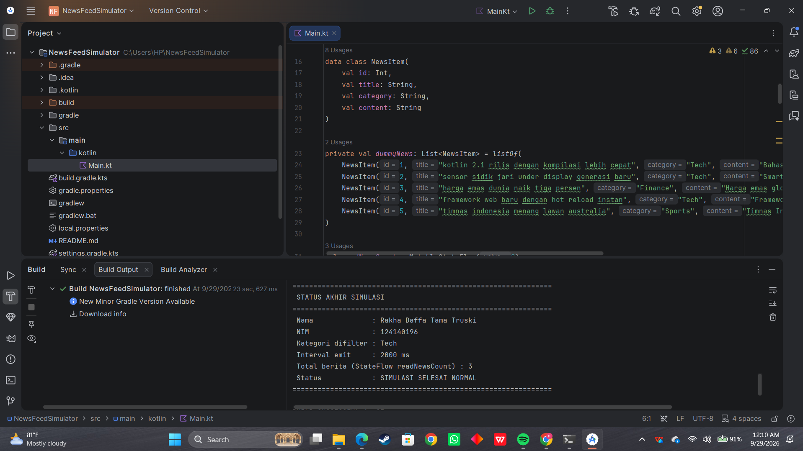

# Praktikum 2 - News Feed Simulator (Advanced Kotlin)

| | |
|---|---|
| **Nama** | Rakha Daffa Tama Truski |
| **NIM** | 124140196 |
| **Mata Kuliah** | Pengembangan Aplikasi Mobile |

---

## Deskripsi Tugas
Aplikasi konsol yang mensimulasikan pemrosesan berita secara asynchronous menggunakan fitur-fitur Advanced Kotlin seperti Coroutines, Flow, StateFlow, dan Error Handling.

## Fitur & Implementasi
- **Flow Builder & Emit**: Mensimulasikan pengiriman data berita baru setiap 2 detik (`delay(2000)`).
- **Operators**: Menyaring kategori berita tertentu (`filter`) dan mengubah format tampilan berita (`map`).
- **StateFlow**: Menyimpan dan memperbarui jumlah berita yang telah dibaca (`readNewsCount`).
- **Coroutines Async/Await**: Mengambil detail berita secara asynchronous (`async` & `await`).
- **Error Handling (Bonus)**: Menangani exception pada Flow menggunakan `.catch` dan `CoroutineExceptionHandler`.

## Cara Jalankan Aplikasi
Jalankan file `Main.kt` menggunakan Gradle command di terminal:
```bash
./gradlew run

## Hasil Running Aplikasi

